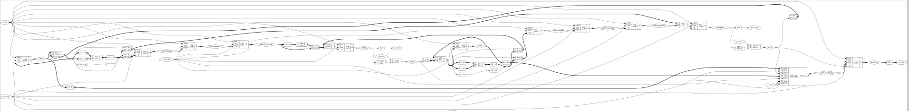

# Asynchronous FIFO

A parameterized asynchronous FIFO implemented in Chisel, using independent read and write clock domains with circular memory addressing, read/write pointers, and cross-domain synchronization.

## Features

- Parameterized data width and depth
- Independent read and write clock domains
- Circular read/write pointers
- Full and empty detection
- Cross-domain pointer synchronization
- Chisel-native randomized verification
- Independent SystemVerilog RTL verification
- Gate-level simulation verified

  
   
  Asynchronous FIFO Synthesis

## Synthesis Results

**Technology:** Sky130 HD
**Tool:** Yosys

| Metric        | Value         |
| ------------- | ------------- |
| Configuration | 16 × 8-bit    |
| Capacity      | 128 bits      |
| Area          | 6730.2048 µm² |

## Static Timing Analysis

**Tool:** OpenSTA

| Clock Domain | Critical Path |   Slack |
| ------------ | ------------: | ------: |
| Read Clock   |       2.94 ns | 3.96 ns |
| Write Clock  |       2.29 ns | 7.55 ns |

**Worst-case Critical Path:** 2.94 ns
**Estimated Fmax:** ~340 MHz

## Power

| Metric      |   Value |
| ----------- | ------: |
| Total Power | 2.13 mW |
