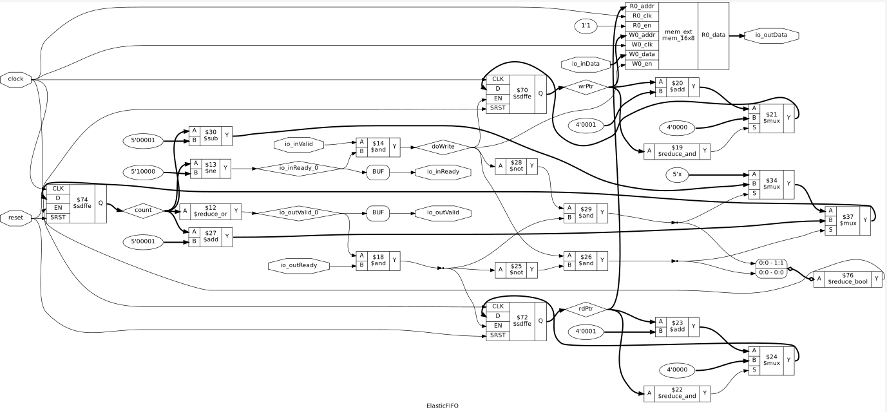

# Elastic FIFO
A parameterized elastic FIFO implemented in Chisel, using a single clock domain with circular read/write pointers, occupancy tracking, and valid/ready flow control for backpressure.

## Features

* Parameterized data width and depth
* Circular read/write pointers
* Valid/ready interface
* Backpressure-based flow control
* Full and empty detection through ready/valid signaling
* Concurrent enqueue/dequeue support
* Chisel-native randomized verification
* Independent SystemVerilog RTL verification
* Gate-level simulation verified

  
   
  Elastic FIFO Synthesis

## Synthesis Results

**Technology:** Sky130 HD
**Tool:** Yosys

| Metric        | Value         |
| ------------- | ------------- |
| Configuration | 16 × 8-bit    |
| Capacity      | 128 bits      |
| Area          | 5620.3904 µm² |

## Static Timing Analysis

Tool: OpenSTA

| Metric         | Value    |
| -------------- | -------- |
| Critical Path  | 2.94 ns  |
| Estimated Fmax | ~340 MHz |
| Slack          | 6.93 ns  |

## Power

| Metric      | Value    |
| ----------- | -------- |
| Total Power | 0.793 mW |
