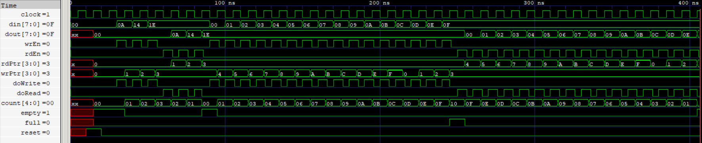

# FIFO Architectures
A collection of FIFO architectures implemented in Chisel, exploring synchronous, asynchronous (CDC), and elastic FIFO designs. The Chisel implementations are elaborated into SystemVerilog and then taken through a conventional RTL simulation, verification, synthesis, and timing-analysis flow.

## 🛠️ Tools & Technologies

## 🏛️ Architectures
- [Synchronous FIFO](Synchronous) - Single-clock FIFO using circular read/write pointers and occupancy tracking

  

Synchronous FIFO

## 🔬 Physical Characterization (Sky130HD)
The following table summarizes post-synthesis implementation results obtained using the Sky130 HD standard-cell library.

> Technology: Sky130 HD

| Architecture | Estimated Area | Critical Path | Estimated Fmax | Estimated Total Power |
|---|---|---|---|---|
| [Synchronous FIFO](Synchronous) | 5915.6736 µm² | 3.03 ns | ~330 MHz | 865 µW |

## 📜License
- Source code and HDL files are licensed under the MIT License.
- Documentation, diagrams, images, and PDFs are licensed under Creative Commons Attribution 4.0 (CC BY 4.0).
