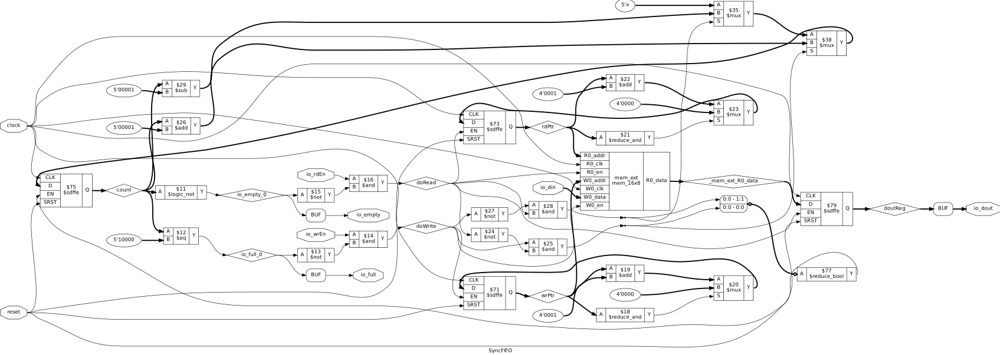

# Synchronous FIFO

A parameterized synchronous FIFO implemented in Chisel, using a single clock domain with circular memory addressing, read/write pointers, and occupancy tracking.

## Features

- Parameterized data width and depth
- Circular read/write pointers
- Full and empty detection
- Concurrent read/write support
- Chisel-native randomized verification
- Independent SystemVerilog RTL verification
- Gate-level simulation verified

  
   
  Synchronous FIFO Synthesis

## Synthesis Results

**Technology:** Sky130 HD  
**Tool:** Yosys

| Metric | Value |
|---|---|
| Configuration | 16 × 8-bit |
| Capacity | 128 bits |
| Area | 5915.6736 µm² |

## Static Timing Analysis

**Tool:** OpenSTA

| Metric | Value |
|---|---|
| Critical Path | 3.03 ns |
| Estimated Fmax | ~330 MHz |
| Slack | 6.84 ns |

## Power

| Metric | Value |
|---|---|
| Total Power | 0.865 mW |
